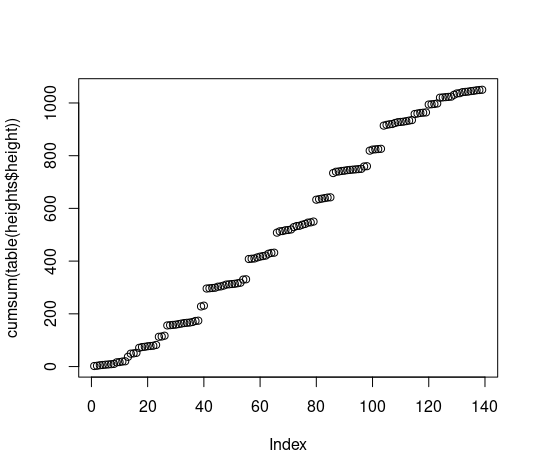
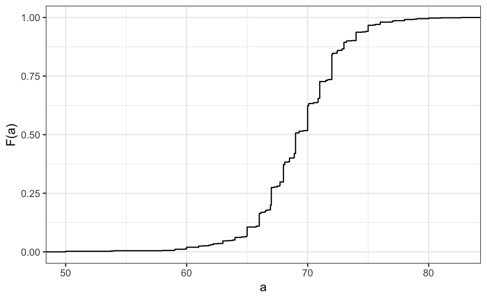
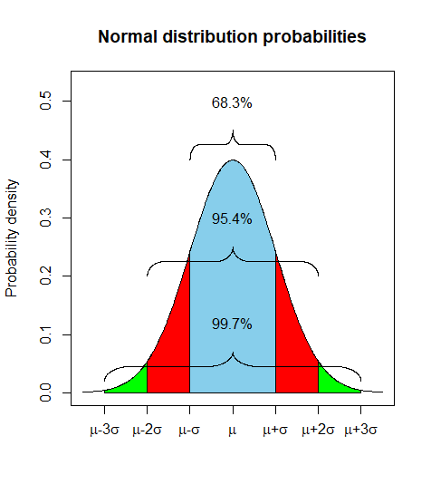

# 1.2. Data Visualization - Distribution

*by Rafael Irizarry*

pretend we need to present the heigth of a class distribution to E.T. the extra terestrial

```R
prop.table(table(heights$sex))
```
|Female|      Male|
|---|--|
|0.2266667| 0.7733333 |

## Cumulative Distribution Function - CDF

$$
\Huge
F(a) = Pr(x \leq a)
$$

**PR stand for probability**

F(b) - F(a) to determine the number of student between 2 arbitrary values



This graph does not show directly the information

## Empirical CDF



## Histogram

A solution could be to **create bin of the same size**

```R
a <- seq(min(tab), max(tab), length = 100)    # define range of values spanning the dataset
cdf_function <- function(x) {    # computes prob. for a single value
    mean(tab <= x)
}
cdf_values <- sapply(a, cdf_function)
plot(a, cdf_values)
```

## Smooth Density Plot

Y = Density (%) = Area under the line = 1

Smooth = smoothed --> estimate (between)

We must consider that the obseved part comes from many many more values and it's just a small part of it. So smoothing and guessing what is inbetween make sense.
Assumption that we can approximate

The smoothed desnity plot is the curve that covers the top of the histogram when the bins are very very small

Use the frequency scale rather than the count scale = **density**

Usage: Easy to compare 2 distribution


## Exercice

### Filtering

```R
male <- table(heights$height[heights$sex == "Male"])
male <- heights$height[heights$sex == "Male"]
sum(male <= 72 & male > 69)/sum(male>0)
mean(male <= 72 & male > 69)
```


### mesuring based on the average and the deviation

**pnorm** must be used to create the whole distribution

pnorm is wroking on **value** equal or below based on **average** and **standard deviation**


```R
library(dslabs)
data(heights)
```

Proportion is similar neat the mean value
```R
x <- heights$height[heights$sex=="Male"]
avg <- mean(x)
stdev <- sd(x)
pnorm(72, avg, stdev) - pnorm(69, avg, stdev)
```

Compare on flat tail
```R
x <- heights$height[heights$sex == "Male"]
exact <- mean(x > 79 & x <= 81)
avg <- mean(x)
stdev <- sd(x)
approx = pnorm(81, avg, stdev) - pnorm(79, avg, stdev)
exact/approx
```

Find every man bigger than 7 feet (84 inches 7*12) with an average of 69 inches and a std dev of 3 inches and in the 10⁹ men in the world between 18 and 40
```R
print(1-pnorm(7*12,69,3))
p <- 1 - pnorm(6*12+8, 69, 3)
N <- round(p * 10^9)
150/N
```

## The Normal Distribution

https://rafalab.github.io/dsbook/distributions.html#normal-distribution

**Bell Curve** or **Gaussian Distribution**

This distribution occurs in a lot of cases.

$$
\Huge
Pr(a < x < b) = \int_a^b \frac{1}{\sqrt{2\pi}s}e^{-\frac{1}{2}(\frac{x-\mu}{\sigma})^2} dx
$$

2 parameters to define eveything:
* **m**: mean (avergage)
* **s**: standard deviation

### Average / Mean (**m**) aka µ

$$
\Huge
\mu = \frac{\sum x_i}{n}
$$

### Standard Deviation (**s**) aka sigma

$$
\Huge
\sigma = \sqrt{ \frac{\sum (x_i - \mu)^2}{N} }
$$

Avergage distance between the value and the mean

## Standard units
### Z

$$
\Huge
z = \frac{(x-\mu)}{\sigma}
$$

in the standard deviation formula we have

$$
\Huge
e^{-\frac{1}{2}(\frac{x-\mu}{\sigma})^2} = e^{-\frac{1}{2}z^2}
$$

**z = 0 is the Maximum**

**it is symetric because of ²**

z is 0 based and is negative for items below the 50% and positive for items above 50% of the distribution

To have standard unit in **R** use **scale**

```R
z <- scale(x)
```
### 2 in standard unit is the 95 percentil for the normal distribution

```R
mean(abs(z) < 2) # 0.9495074
```

A normal distribution is normal for 95% in the standard distribution model so here we are pretty close

Meaning that 95% of the data are between [-2; 2]

## Quantile plots
### 1, 2, 3 - 68.3%, 95%, 99.7%

In standard unit

| Std U | percent distribution | z | z interval |
|------:|----------------------|-------|--------|
| 1     | 68.3%| $\|z\| \leq 1$ | $[-1;1]$ |
| 2     | 95%|$\|z\| \leq 2$ | $[-2;2]$ |
| 3     | 99.7%|$\|z\| \leq 3$ | $[-3;3]$ |

and correspond to the following distribution in the graph


## Cumulative Distribution

To answers wuestions such as How many person are taller or shorter than x

```R
pnorm(x, average, sd)
```

### Taller than size x

```R
taller_than_70 <- 1 - pnorm(70.0, mean(x), sd(x))
```

## Continuous and discrete value

Height are discrete value, and because human round that up in different ways we need to considere them under the prism that no one is exactly 70 inches or 176.89 cm because people round up and the data gathering is biased ==> assuming that this discretes values are continuous is a good bet but need to be considered in each cases.

So when we check for propability in height for instance we consider the probability in an interval [69.5;70.5] for 70 because people will round by themselve above or below to the nearest unit.

But value in interval not logically rounded will be erroneous with normal distribution

### Discretization

[70.1;70.9] is not good

|inteval| real data | standard distribution | error |
|-----------|-----------|-----------------------|-------|
| [68.5;69.5] |           |                       |       |
| [69.5;70.5] |           |                       |       |
| [70.1;70.9] |           |                       |       |

## Hands on

```R
install.packages("tidyverse")
library(tidyverse)
library(dslabs)
data(heights)
x <- heights %>% filter(sex=="Male") %>% pull(height)

# plot distribution of exact heights in data
plot(prop.table(table(x)), xlab = "a = Height in inches", ylab = "Pr(x = a)")

# probabilities in actual data over length 1 ranges containing an integer
mean(x <= 68.5) - mean(x <= 67.5)
mean(x <= 69.5) - mean(x <= 68.5)
mean(x <= 70.5) - mean(x <= 69.5)

# probabilities in normal approximation match well
pnorm(68.5, mean(x), sd(x)) - pnorm(67.5, mean(x), sd(x))
pnorm(69.5, mean(x), sd(x)) - pnorm(68.5, mean(x), sd(x))
pnorm(70.5, mean(x), sd(x)) - pnorm(69.5, mean(x), sd(x))

# probabilities in actual data over other ranges don't match normal approx as well
mean(x <= 70.9) - mean(x <= 70.1)
pnorm(70.9, mean(x), sd(x)) - pnorm(70.1, mean(x), sd(x))
```

